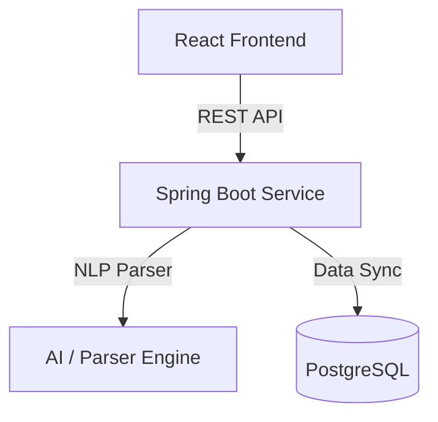

# Resume Intelligence Platform

An AI-powered platform designed to parse, analyze, categorize, and rank resumes using advanced machine learning, natural language processing, and robust backend/frontend workflows.

## Features

- **Automated Resume Parsing**: Extract structured data (contact info, skills, experience, education) from PDF, DOCX, and text resumes.
- **AI Skill Matching & Classification**: Semantic searching and mapping of candidate profiles to job descriptions.
- **Resume Scoring & Ranking**: Smart scoring system based on context, experience relevance, and skill gaps.
- **Analytics & Dashboard**: Interactive visual reports on candidate distributions, experience level breakdowns, and hiring pipelines.
- **Docker-ready Setup**: Containerized services for easy deployment and scale.

## Tech Stack

- **Frontend**: React, JavaScript (ES6+), HTML5, CSS3, Vite
- **Backend**: Java, Spring Boot, Spring Security, JPA/Hibernate
- **Database**: PostgreSQL / H2 Database (for testing)
- **Containerization & Devops**: Docker, GitHub Actions CI/CD
- **Build Tools**: Maven, npm / yarn

## Architecture

The platform uses a decoupled frontend-backend architecture:
1. **Client Layer**: React-based SPA communicating via RESTful API.
2. **API Gateway & Services**: Spring Boot service handling controller logic, file processing, NLP parsing services, and business rules.
3. **Data Layer**: Relational database for storing candidate data, parser models, and system metrics.



## Installation

### Prerequisites
- JDK 17+
- Node.js 18+ & npm
- Docker & Docker Compose (optional)

### Cloning the Repository
```bash
git clone https://github.com/prakashbtech87/resume-intelligence-platform.git
cd resume-intelligence-platform
```

## Local Development

### Running the Backend (Spring Boot)
```bash
cd backend # Assuming backend is in backend folder
./mvnw spring-boot:run
```

### Running the Frontend (React)
```bash
cd frontend # Assuming frontend is in frontend folder
npm install
npm run dev
```

## Docker Setup

To build and run all services in containers:
```bash
docker-compose up --build
```

## API Documentation

Interactive API documentation is generated via Swagger/OpenAPI when running the backend.
- Swagger UI: `http://localhost:8080/swagger-ui.html`

### Key Endpoints:
- `POST /api/v1/resumes/upload` - Upload and parse a resume file.
- `GET /api/v1/resumes` - Retrieve list of parsed resumes.
- `POST /api/v1/match` - Score and match resumes against a job description.

## Screenshots Placeholder


## License

This project is licensed under the MIT License - see the LICENSE file for details.
